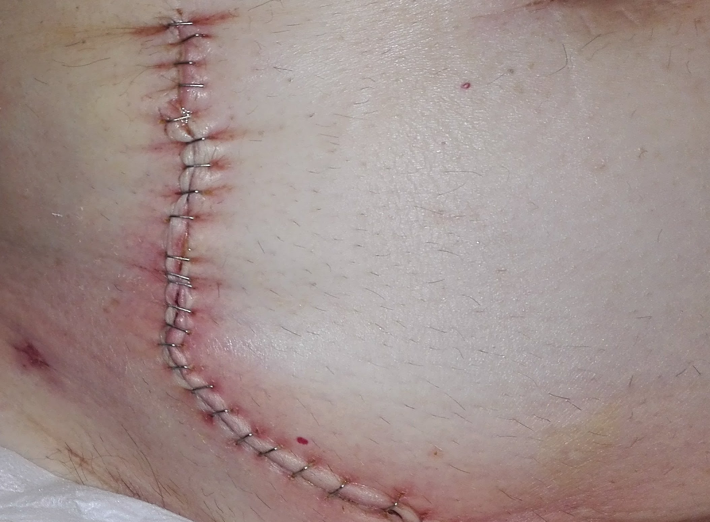

# Staples Detection

The first pure-Python library to detect staples in abdominal surgery images. The theoretical basis of this library 
are the following publications:

```
González-Hidalgo M, Munar M, Bibiloni P, Moyà-Alcover G, Craus-Miguel A & Segura-Sampedro JJ (2019)
Detection of infected wounds in abdominal surgery images using fuzzy logic and fuzzy sets
IEEE International Conference on Wireless and Mobile Computing, Networking And Communications (WiMob).
``` 

```
González-Hidalgo M, Munar M, Bibiloni P, Moyà-Alcover G, Craus-Miguel A & Segura-Sampedro JJ (2019)
Detection and Automatic Deletion of Staples in Images of Wound of Abdominal Surgery for m-Health Applications.
VII ECCOMAS Thematic Conference on Computational Vision and Medical Image Processing. 
``` 

```
Munar M., González-Hidalgo M. & Moyà G.(2020).
Entorno de telemedicina para el seguimiento de complicaciones postquirúrgicas en cirugía abdominal para la 
    realización de un estudio clínico
Master's Thesis – Universitat de les Illes Balears
``` 

## Installation

To install the library, simply run the command :
```
pip install staples-detection
```

To use it, import the library:
```
import staples_detection
```

## Example

To be able to detect staples in the image, the StapleDetector object must be initialized, passing the image to be analyzed as a parameter. The library itself contains a method for loading the two demo images provided.

For example, to analyse the following image (which corresponds to the image `img001.png`) just execute the following code:

<p align="center">
  
</p>